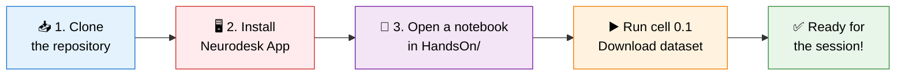
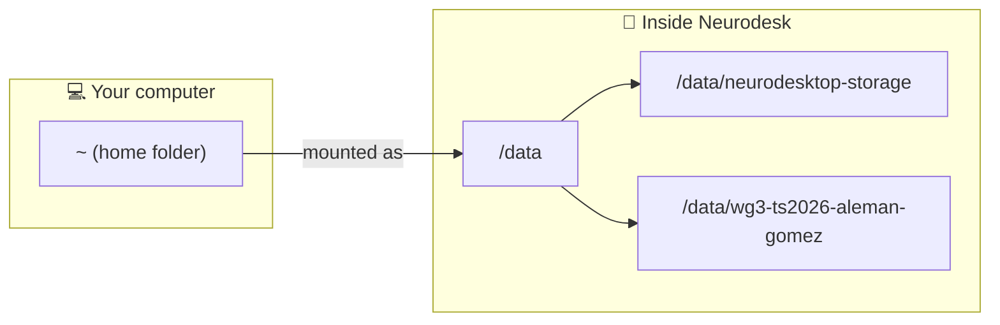

<div align="center">

# 🧠 Practical Session — Setup Guide

**INDoS WG3 Training School 2026 · Structural & Diffusion MRI Hands-On**


</div>

> [!IMPORTANT]
> Complete **all** steps **before** the practical session. The dataset download is large and can take a while — don't leave it until the last minute!

---

## 🗺️ Overview



| Step | What | Required |
|:---:|---|:---:|
| **1** | 📥 Clone the course repository | ✅ |
| **2** | 🖥️ Install the Neurodesk App | ✅ **Mandatory** |
| **3** | ▶️ Download the dataset (cell 0.1) | ✅ |

---

## 📥 Step 1 — Clone the repository

Open a terminal and move to a folder **inside your home directory**, so it is visible from Neurodesk later (see Step 2).

```bash
cd ~
git clone https://github.com/indos-costaction/wg3-ts2026-aleman-gomez.git
cd wg3-ts2026-aleman-gomez
```

You should see this structure:

```
wg3-ts2026-aleman-gomez/
├── 📁 HandsOn/
│   ├── 📓 01-FreeSurfer_SingleSubject-Processing-HandsOn.ipynb
│   └── 📓 02-DWMRI-Processing-HandsOn.ipynb
├── 📁 Presentations/
└── 📄 README.md
```

> [!TIP]
> **No `git`?** Install it first: `sudo apt install git` (Ubuntu/Debian), or download it from [git-scm.com](https://git-scm.com/downloads) (macOS/Windows).

---

## 🖥️ Step 2 — Install the Neurodesk App

> [!CAUTION]
> **This step is mandatory.** The whole practical runs inside Neurodesk, which provides all the neuroimaging software (FreeSurfer, MRtrix3, FSL, ANTs…).

1. Go to 👉 **[neurodesk.org](https://www.neurodesk.org)**
2. Download and install the **Neurodesk App** for your operating system, following the official guide.
3. Launch the app once to check it starts correctly.

### 📂 Where are my files inside Neurodesk? (Linux)

On Linux, Neurodesk mounts your **home directory** at **`/data`** and creates a folder called **`neurodesktop-storage`** inside it.



| 💻 On your computer | 🐳 Inside Neurodesk |
|---|---|
| `~` (home folder) | `/data` |
| `~/wg3-ts2026-aleman-gomez` | `/data/wg3-ts2026-aleman-gomez` |
| — | `/data/neurodesktop-storage` |

---

## ▶️ Step 3 — Download the dataset

Once the repository is cloned **and** Neurodesk is installed:

| | Action |
|:---:|---|
| 1️⃣ | Open **Neurodesk** |
| 2️⃣ | Navigate to the repository and open the **`HandsOn/`** folder |
| 3️⃣ | Open **any** of the notebooks |
| 4️⃣ | Run the cell **`0.1 Dataset: Downloading the dataset`** |

> [!NOTE]
> Wait until the cell finishes **without errors**. If the data is already there, the cell will simply tell you so and skip the download.

---

## ✅ Pre-session checklist

- [ ] 📥 Repository `wg3-ts2026-aleman-gomez` cloned on my computer
- [ ] 🖥️ Neurodesk App installed and starting correctly
- [ ] 📂 Repository visible from inside Neurodesk
- [ ] ▶️ Cell **0.1 Dataset** run and dataset downloaded successfully

---

## 🛠️ Troubleshooting

<details>
<summary><b>I can't see the repository inside Neurodesk</b></summary>

<br>

Make sure you cloned it **inside your home directory** (e.g. `~/wg3-ts2026-aleman-gomez`). Folders outside your home are not mounted into Neurodesk.

</details>

<details>
<summary><b>The download cell says "Got a web page, not a file"</b></summary>

<br>

The download link may have expired or be temporarily unavailable. Please contact the instructor.

</details>

<details>
<summary><b>Neurodesk does not start</b></summary>

<br>

Check the troubleshooting section of the official [Neurodesk documentation](https://www.neurodesk.org) and make sure your system meets the requirements.

</details>

---

<div align="center">

❓ **Problems?** Get in touch **before** the session so we can solve them in advance.

<sub>Part of the <a href="https://github.com/indos-costaction/">INDoS COST Action (CA24161)</a> training material · Author: Yasser Alemán-Gómez</sub>

</div>
